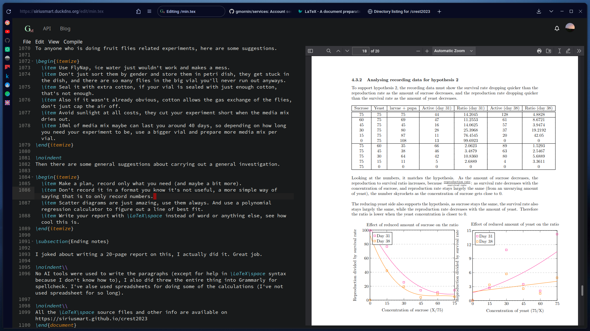

# Overview

Welcome to GoodMorning Tex - a minimal and easy to use **multiformat editor** and publishing platform for the web.



You have the freedom to publish your work privately or publicly, written in any format. Browse notes by others or take your own (the "I paid attention in class" flex), it's entirely up to you.

> GM Tex is a fresh project in its early development, **_missing features are expected_**.

## Roadmap

As in early development, here are some of the features which GM Tex currently offers, or are planned to be implemented.

- [x] Compiling LaTex, Markdown documents.
- [x] Previewing plain text files, images and documents.
- [x] Editing files in web editor.
- [ ] Basic file operations. (missing moving/renaming files)
- [x] Full profile customisations.

---

- [ ] Publishing documents (cannot directly access items using publish ID, nor is it in web UI)
- [ ] Creating collections from published items.
- [ ] Following users, collections, and get notifications from it.

## Goals

The goal is to create a **federated publishing service**, for learners to read and write notes, and _I-want-internet-validation_ people to publish articles for upvotes.

## Hosting

Self hosting a GM Tex instance is very simple.

Requirements:

- A local MongoDB instance running
- PDFLatex from TexLive
- Firejail
- Basic packages, such as `cargo`, `openssl`, etc. (Rust nightly is required).
- Root privileges (sudo) - as a result **Linux is required** to run an instance (as if anyone would host it on Windows anyways)

Run the following commands:

```sh
git clone https://github.com/gmornin/gmt-server &&
cd gmt-server &&
cargo install --path . &&
gmt-server
```

This would prompt you to enter your sudo password, just do it.

The server should immediately exit with some error messages, this is because the config files are not configured out of the box (to prevent your personal files from getting accessed).

**Make sure to go through all config files**, you can generate an SSL certificate using [certbot](https://certbot.eff.org/).

Congratulations you are now running a GM Tex instance.
