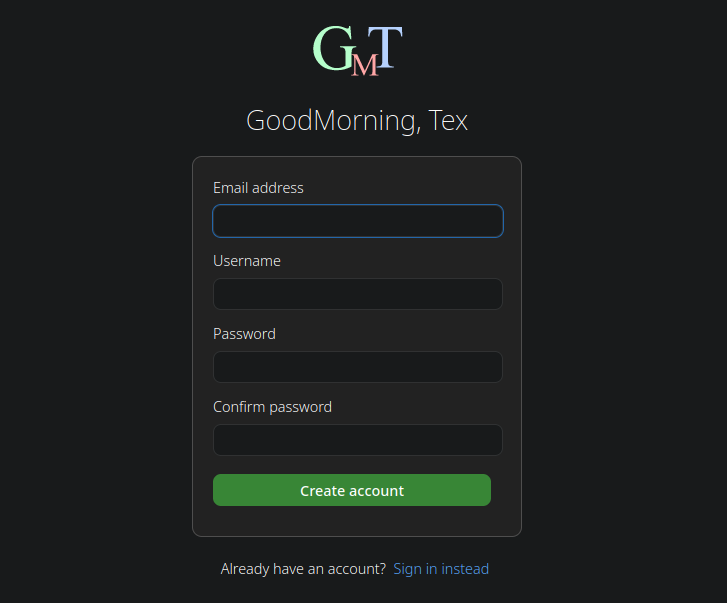
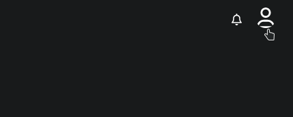
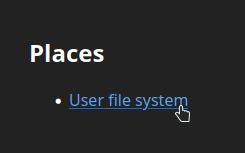
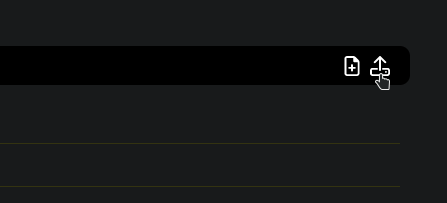
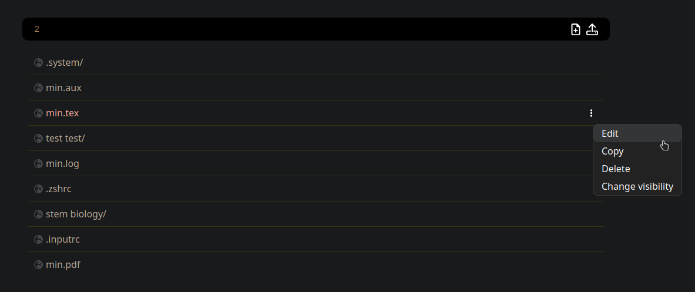
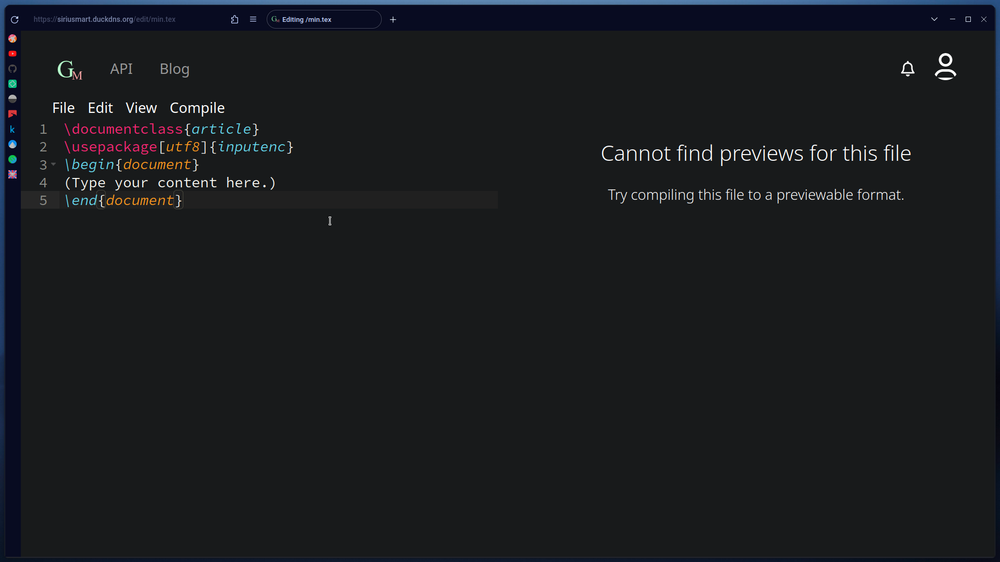
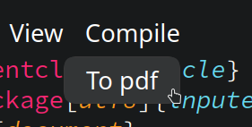
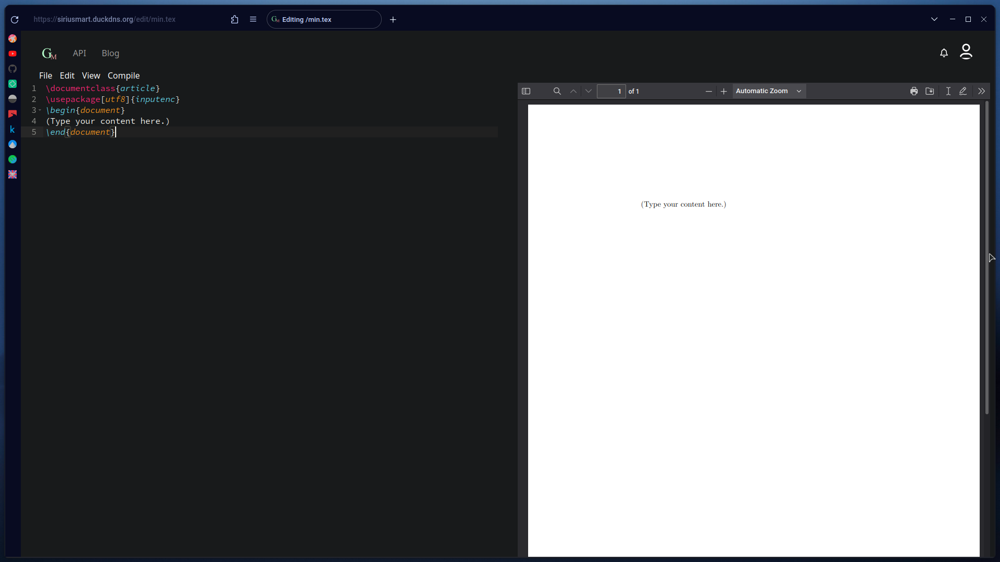

# Setting up

This article guides you from **creating your account**, to **editing your first document** on GM Tex.

## Development progress

- [x] Sign up/sign in pages.
- [x] Enabling GM Tex to user's GoodMorning account.
- [ ] Request a resend of the verification email.
- [x] Uploading files, or creating blank text documents.
- [x] Compiling LaTeX and Markdown to various formats such as PDF and HTML.

## 1. Create an account

Click the _register_ button to navigate to the sign up page.

Enter the basic details required for account creation.

> A valid email address is required to receive the **_verification email_**.



Congratulations! You have created your **GoodMorning account**.

## 2. Enabling GM Tex for your GoodMorning account

Without going into great details as to why, **GM Tex** is merely a _service_ available to GoodMorning accounts, and must be enabled before using.


Here's a brief of what happens when you enable the GM Tex service:

1. A GM Tex profile was created in database.
2. GM Tex was marked as enabled in account, so that you will be able to use certain API endpoints which are only allowed for GM Tex users.
3. A **personal directory** for GM Tex is created for you.

## 3. Get a file onto the file system

Navigate to your personal directory, here's how.




Upload or create a file to start editing.



## 4. Using the editor

Click the **_3 dots_** and enter the editor.



Paste in this **_LaTeX starter template_** and start editing.

```latex
\documentclass{article}
\usepackage[utf8]{inputenc}
\begin{document}
(Type your content here.)
\end{document}
```



Under the "compile" option, compile the LaTeX document to PDF.



Your document will be compiled to PDF using the **PDFLatex** compiler. Currently compile formats and options are quite limited.

| Source format | Target format | Compiler                                                      |
| ------------- | ------------- | ------------------------------------------------------------- |
| LaTeX         | PDF           | PDFLatex                                                      |
| Markdown      | HTML          | [pulldown-cmark](https://github.com/raphlinus/pulldown-cmark) |

> More formats will be added, such as LaTeX to HTML and [Typst](https://github.com/typst/typst)

And there you go. You have created, edited, and compiled your first LaTeX document on GM Tex!


